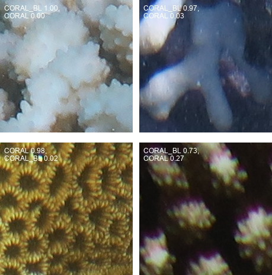

# Open Science AI/ML Showcase Examples
**AI/ML models, tools, and deployment examples focused on marine ecosystem applications .**

**Developer Contact:** [Michael.Akridge@noaa.gov](mailto:Michael.Akridge@noaa.gov)

**Code:** https://github.com/MichaelAkridge-NOAA/open-science-ai-toolkit

<details>
  <summary><strong>Table of Contents</strong></summary>

1. [Overview](#overview)
2. [Models](#models)
   - [YOLO11 Architecture](#yolo11-architecture)
     - [Fish Object Detection](#fish-object-detection-model)
     - [Fish Segmentation](#fish-segmentation-model)
     - [Urchin Object Detection](#urchin-object-detection-models)
   - [YOLOv8 Architecture](#yolov8-architecture)
     - [Fish Object Detection](#fish-object-detection-yolov8)
3. [Desktop Tools & GUIs](#desktop-tools--guis)
   - [Simple GUI for Model Training](#simple-gui-model-training)
   - [Advanced GUI: Open Science AI Toolbox](#advanced-gui-open-science-ai-toolbox)
     - [YOLO11 Object Detection Training](#yolo11-object-detection-training)
     - [Dataset Preparation Tools](#dataset-prep)
     - [Dataset Viewer](#dataset-viewer)
     - [Advanced Metrics with Plotly](#advanced-metrics-using-plotly)
     - [Point Segmentation using SAM](#point-segmentation-using-sam-model)
     - [CoralNet Annotations to SAM Segmentation](#coralnet-to-sam-segmentation)
4. [Web Applications](#web-applications)
   - [Coral Analysis](#coral-analysis)
     - [Coral Feature Extraction](#coral-feature-extraction)
     - [Coral Segmentation & Class Mask Coverage](#coral-segmentation)
   - [Urchin Object Detection (Web)](#urchin-object-detection-web)
     - [Multiscale Patch-Based Detection](#multiscale-patch-detection)
     - [Batch Processing of Predictions](#batch-processing-of-urchin-detection)
     - [SfM Mosaic Detection](#sfm-mosaic-detection)
   - [Other Examples](#other-examples)
     - [Auto Segmentation with YOLO & SAM](#auto-segmentation)
     - [YOLO-World Inference](#yolo-world-inference)
     - [Fish vs. No Fish Examples](#fish-no-fish-examples)
   - [Depth Estimation Using ML](#depth-estimation)
5. [Cloud Deployments](#cloud-deployments)
   - [Google Cloud Shell Deployment](#google-cloud-shell-deployment)
   - [One-Click Cloud Deployment](#one-click-cloud-deployment)
   - [Batch Processing with Job Management](#batch-processing)
6. [Mobile Deployment](#mobile-deployment)
   - [Apple iOS Object Detector Deployment](#apple-ios-deployment)
7. [Disclaimer & License](#disclaimer--license)

</details>

## Models
### Patch Based Vision Transformer Model Architecture (google/vit-base-patch16-224)
### Technologies Used: 
- PyTorch, Hugging Face Transformers, Vision Transformer (ViT), Python, PIL, Torch Datasets,streamlit, gradio
#### Coral Bleaching Classifier (ViT)
- **Model Card:** [Hugging Face Model Card](https://huggingface.co/akridge/noaa-esd-coral-bleaching-vit-classifier-v1)
- **Demo:** [Link](https://huggingface.co/spaces/akridge/Coral-Bleaching-Classifier-Demo)
 
### Description:
- Developed and trained a coral bleaching image classification model using a Vision Transformer (ViT) architecture to distinguish between healthy coral and bleached coral.
### Model Architecture: 
- Leveraged and fine-tuned a pre-trained Google ViT-base-patch16-224 model.
- Fine-tuned only the classifier head while freezing the backbone to preserve learned features and reduce training time.
### Data Processing:
- Processed point-based annotations from NOAA/CoralNet to create training dataset.
- Generated cropped/patch-based images aligned with annotated points to ensure consistent input sizes and accurate label matching.
- Organized data into structured folders compatible with classification pipelines (train/validation/test splits).
- Employed the Hugging Face Datasets library to load and preprocess images.
- Converted images to RGB format and applied tokenization with AutoImageProcessor for ViT compatibility.
- Implemented efficient data transformation and collation functions to manage pixel values and label mappings.
### Training & Evaluation:
- Defined training parameters using the TrainingArguments class, optimizing for 100 epochs with batch sizes of 16 and a learning rate of 3e-4.
- Conducted evaluation at each epoch to monitor performance using an accuracy metric from the evaluate library.
- Achieved consistent model convergence while limiting overfitting via early stopping and best-model loading strategies.
### Results & Deployment:
- Achieved high classification accuracy in differentiating coral health states.
- Exported and saved both the trained model and processor for future deployment or inference.
- Future Model training readily deployable using developed pipelines.
- Deployed to Demo page using python streamlit and gradio
**Examples:**

  
  
  

### YOLO11 Architecture

#### Coral Bleaching Classifier (YOLO11n-cls)
- **Model Card:** [Hugging Face Model Card](https://huggingface.co/akridge/yolo11n-cls-noaa-esd-coral-bleaching)
- **Examples:**

  
  

#### Fish Object Detection Model
- **Model Card:** [Hugging Face](https://huggingface.co/akridge/yolo11-fish-detector-grayscale)
- **Example GIF:**
  

#### Fish Segmentation Model
- **Model Card:** [Hugging Face](https://huggingface.co/akridge/yolo11-segment-fish-grayscale)
- **Example GIF:**
  

#### Urchin Object Detection Models
- **Nano:** [Model Card](https://huggingface.co/akridge/yolo11n-sea-urchin-detector)
- **Medium:** [Model Card](https://huggingface.co/akridge/yolo11m-sea-urchin-detector)
- **XLarge:** [Model Card](https://huggingface.co/akridge/yolo11x-sea-urchin-detector)
  
  
#### Model Benchmarking
## Benchmarks
|index|Format|Status|Size \(MB\)|metrics/mAP50-95\(B\)|Inference time \(ms/im\)|FPS|
|---|---|---|---|---|---|---|
|0|PyTorch|✅|38\.7|0\.5694|23\.69|42\.21|
|1|TorchScript|✅|77\.1|0\.5619|21\.34|46\.86|
|4|TensorRT|✅|86\.4|0\.5619|20\.72|48\.27|
|6|TensorFlow SavedModel|✅|193\.1|0\.5619|40\.84|24\.48|
|7|TensorFlow GraphDef|✅|76\.8|0\.5619|38\.65|25\.88|

### YOLOv8 Architecture

#### Fish Object Detection
- **Model Card:** [Hugging Face](https://huggingface.co/akridge/yolo8-fish-detector-grayscale)

---
## AI for Marine Ecosystems (AI4ME) API
AI4ME API provides **low-code** APIs for **machine learning-based image analysis** tools focused on marine research.


- 🔗 **API Link**: [Link](https://connect.fisheries.noaa.gov/ai4me/docs) 
- 🔗 **GitHub Repository**: [Link](https://michaelakridge-noaa.github.io/ai4me-cookbook/content/0X_deploy/01_ai4me_api.html)   

## 🔹 Features
- **🌍 Platform-Agnostic:** Low-code and accessible via Python, R, shell, or any HTTP client.
- **🔑 Secure:** Requires an API key for restricted endpoints.
- **📊 Scalable & Fast:** Leverages optimized **YOLO models** for rapid predictions.
- **🖼️ Supports Image Uploads:** Accepts images up to **20MB**.
- **🌊 Research-Focused:** Designed for **marine ecosystem analysis**.

## Desktop Tools & GUIs

### Simple GUI for Model Training
*(YOLO11 (Ultralytics) Wrapper using PyQT5)*
- **Screenshot:**
  

### Advanced GUI: Open Science AI Toolbox
- **Overview Screenshot:**
  

#### YOLO11 Object Detection Training
- **Screenshot:**
  

#### Dataset Preparation Tools
- *Placeholder for dataset preparation tools.*

#### Dataset Viewer
- Upload a `dataset.yaml` file to view images and bounding box overlays for dataset QA/QC.
- **Screenshot:**
  

#### Advanced Metrics using Plotly
- Upload a `Training results.csv` file to generate training metrics charts.
- **Screenshot:**
  

#### Point Segmentation using SAM Model
- **Screenshot:**
  

#### CoralNet Annotations to SAM Segmentation
- Example CoralNet dataset (CSV format):
```
  csv | # example dataset
  name,label_code,row,column
  "./OAH-2749_2016_B_04.JPG",TURFR,614,2903
  "./OAH-2749_2016_B_04.JPG",TURFH,692,1763
  "./OAH-2749_2016_B_04.JPG",TURFR,985,704
  "./OAH-2749_2016_B_04.JPG",TURFH,1205,3443
  "./OAH-2749_2016_B_04.JPG",TURFH,2387,100
  "./OAH-2749_2016_B_04.JPG",MOEN,1814,3221
  "./OAH-2749_2016_B_04.JPG",SAND,1886,1092
  "./OAH-2749_2016_B_04.JPG",TURFH,1930,1802
  "./OAH-2749_2016_B_04.JPG",TURFH,1933,2825
  "./OAH-2749_2016_B_04.JPG",TURFR,1470,887
```
- **Screenshot:**
  
## Web Applications

### Coral Analysis

#### Coral Feature Extraction
- EfficientNet-based feature extraction.
- **Screenshot:**
  

#### Coral Segmentation & Class Mask Coverage
- **Coral Instance Segmentation (YOLO11):**
  
- **Coverage Visualization:**
  

### Urchin Object Detection (Web)
  
#### Multiscale Patch-Based Detection
- **Screenshots:**
  
  

#### Batch Processing of Predictions
- **GIF Example:**
  

#### SfM Mosaic Detection
- Using a crop-based approach.
- **GIF Example:**
  

### Other Web Applications

#### Auto Segmentation with YOLO & SAM
- **Screenshot:**
  

#### YOLO-World Model Inference
- Pre-trained “prompt-then-detect” model with prompt “fish”.
- **Screenshot:**
  

#### Depth Estimation Using Machine Learning
- **Project Repo:** [ml-depth-pro on GitHub](https://github.com/MichaelAkridge-NOAA/ml-depth-pro)
- **Depth Estimation Visualization App:** [ML Depth Pro](https://connect.fisheries.noaa.gov/ml_depth_pro/)
  
  <a href="https://connect.fisheries.noaa.gov/ml_depth_pro/" target="_blank">
    
  </a>

- **YOLO + Apple Depth Pro Integration:**  
  Combines YOLO11 object detection with depth estimation (including focal length prediction & scaling based on ground truth).  
  **Before/After Comparison:**
  
- **Animated Depth Visualization:**
  

#### Fish vs. No Fish Examples
- **Screenshots:**
  
  
  
    
---

## Cloud Deployments

### Google Cloud Shell Deployment
- **Overview:**  
  Custom containerized (Docker) deployment of a Python-based Streamlit web app that runs object detection on data from a Google Cloud Bucket.
- **GIF Example:**
  

### One-Click Cloud Deployment
- **Deploy with a Single Click:**
  [](https://shell.cloud.google.com/cloudshell/editor?cloudshell_git_repo=https%3A%2F%2Fgithub.com%2FMichaelAkridge-NOAA%2FFish-or-No-Fish-Detector&cloudshell_git_branch=MOUSS_2016&cloudshell_print=cloud-shell-readme.txt&cloudshell_workspace=google-cloud-shell&cloudshell_tutorial=TUTORIAL.md)

### Batch Processing with Job Management
- Enables a job queue system for starting and stopping object detection processing.
- **Screenshot:**
  

---

## Mobile Deployment

### Apple iOS Object Detector Deployment
- **Overview:**  
  YOLO11 fish detection model converted to CoreML and deployed using an Ultralytics app template.
- **Model Link:**  
  [mouss-fish-Core-ML model on Hugging Face](https://huggingface.co/akridge/yolo11-fish-detector-grayscale/commit/6bc514313f7a25df726bd0d20a2b3d8787d53476)
- **Performance:**  
  Achieves >60 FPS on iPhone 15 Pro Max.
- **Diagram:**
  

---

## Disclaimer & License

#### Disclaimer
This repository is a scientific product and is not official communication of the National Oceanic and Atmospheric Administration or the United States Department of Commerce. All NOAA GitHub project content is provided on an “as is” basis, and the user assumes responsibility for its use. Any claims arising from the use of this project will be governed by applicable Federal law. References to specific commercial products, processes, or services do not imply endorsement by the Department of Commerce or any of its bureaus. The Department of Commerce seal and logo (or that of a DOC bureau) may not be used to imply endorsement of any commercial product or activity.

#### License
See [LICENSE.md](./LICENSE.md) for details.
